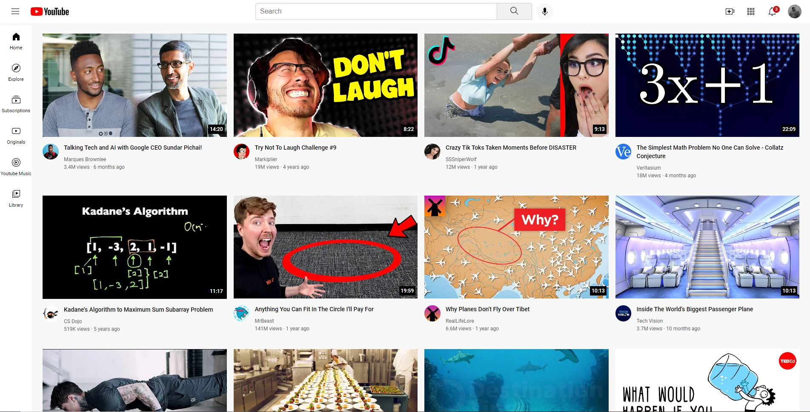

# [Vanilla CSS Youtube Clone](https://chamathcodes.com/vanilla-css-youtube-clone/)

A code along project where a version of the Youtube landing page was created using vanilla CSS. The objective of the project was to practice CSS.

### [Check out the project](https://chamathcodes.com/vanilla-css-youtube-clone/) 👈
